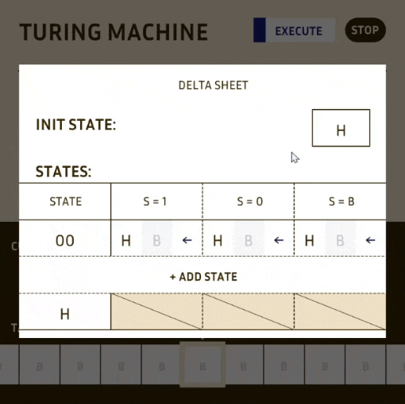
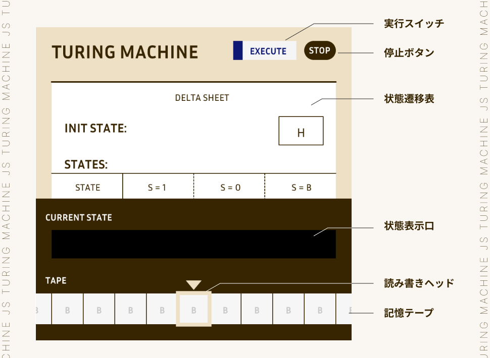
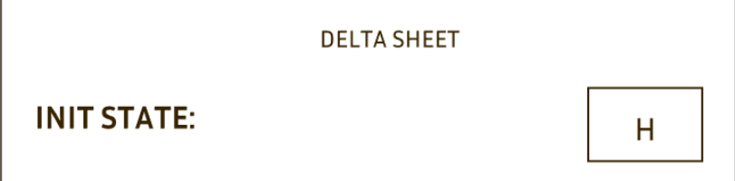
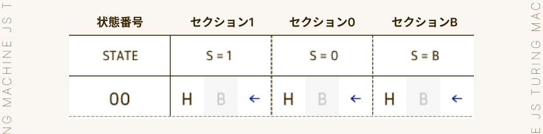
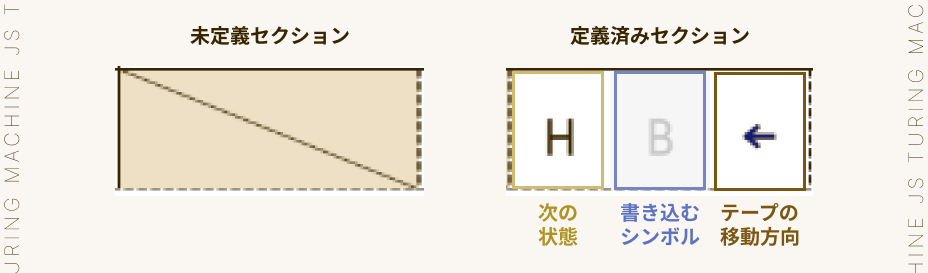

# TuringMachineJS

p5.js を使い、見た目よし！動きよし！なチューリングマシンを作りました。

(デモ動画は1を加算するプログラムを実行する様子です。)

[ここから遊べます](https://chloro096.github.io/TuringMachineJS/)

## チューリングマシンとは？

1936 年に、アラン・チューリングが考えた架空の機械です。

構造はシンプルで、文字が一つ書き込める「マス目」が無限に並んだ 1 次元の記憶テープと、マス目を読み書きするヘッド、読み取った内容に応じて処理を行う制御部の 3 つからなります。

制御部の処理に基づいて、テープを左右に動かしながら文字を読み書きすることで計算を行います。

世の中には様々な計算モデルがあり、それぞれのモデルで計算可能なことと、計算可能でないことがあります。

ではそれら全てを含めて、機械的に計算できることの限界はどこにあるのでしょうか。

現在のところ、それは万能チューリングマシンと同等の計算能力を持つ計算モデルにより計算可能であることだと考えられています(チャーチ・チューリングのテーゼ)。

万能チューリングマシンと同等の計算能力を持つ計算モデルは「チューリング完全」であるといい、計算モデルがもつ計算能力の指標として用いられます。

## 遊びかた

### 各部説明

- 実行スイッチ / 停止ボタン :

  実行スイッチをクリックするとチューリングマシンが動作します。動作中に停止ボタンをクリックすると実行を中断し停止します。

- 状態遷移表 :

  チューリングマシンの「プログラム」を書き込みます。クリックすると編集できます。編集中はシートの外側をクリックすることで元の画面に戻ります。

- 状態表示口 :

  実行中、「現在の状態」を表示する穴です。

- 読み書きヘッド :

  記録テープに読み取り/書き込みを行うヘッドです。

- 記録テープ :

  チューリングマシンのプログラムに与える「入力」を書き込んだり、それに対する「出力」が書き込まれたりするテープです。各マスには1, 0, Bいずれかのシンボルを1つ書き込むことが出来ます。

### チューリングマシンの動き

チューリングマシンは、状態遷移表に応じて記憶テープのシンボルを読み書きしながら状態遷移を繰り返す機械です。

状態遷移表を「プログラム」、記憶テープを「入力・出力」に対応させて考えるとわかりやすいと思います。

具体的には以下の4ステップを繰り返します。

1. テープの読み取り

   まず、読み書きヘッドの位置にある記憶テープの「マス」を読み取ります。

   各マスには1, 0, Bのいずれかのシンボルが1つ書かれています。

   ***

   シンボル S := { 1 | 0 | B }
   - B : BlankのB。空白文字。何も書かれていないことを表すのに使える。

   ***

2. 状態遷移表の確認

   テープを読み取ると、次に状態遷移表を確認します。

   状態遷移表は各行がそれぞれ1つの状態を表します。このうち、「現在の状態」は状態表示口に表示されます。一番初めの状態は、状態遷移表の冒頭「INIT STATE」で決めることが出来ます。

   

   各状態には「S=1」, 「S=0」, 「S=B」の3つのセクションあります。

   

   チューリングマシンはこの3つのうち、先ほどテープから読み取ったシンボルに対応するセクションを確認します。

   セクションは、「未定義」である場合と「定義済み」である場合の2通りがあります。

   

   未定義である場合、ここでチューリングマシンは停止し、実行を終了します。

   定義済みであるセクションには3つの情報が記録されています。左からそれぞれ「次に遷移する状態」「テープに書き込むシンボル」「テープの移動方向」です。

   ***

   状態 Q := { H | 00 | 01 | 02 | ... }
   - H : HoltのH。1,0,B全てのセクションが未定義になっており、実行を終了するための状態として使える。
   - 状態は任意の数だけ増やすことが出来る。

   ***

   移動方向 D := { L | R }
   - 左(L)か右(R)のいずれか。

   ***

3. テープの書き換えと移動

   遷移表から読み取った情報を基に、テープの書き換えと移動を行います。

   まず、読み書きヘッドの位置のマスを読み取った「書き込むシンボル」に上書きします。

   その後、読み取った「移動方向」へ1マス、テープを移動させます。

4. 状態の遷移

   最後に「次に遷移する状態」へ状態遷移を行います。次はこれを「現在の状態」として、1.の手順から再び動作を行います。

   これを停止するまで繰り返すことで計算を行います。

### 操作方法

- テープ
  - 右矢印キー, 左矢印キーで左右に移動
  - マウスで「マス」をホバーし、1, 0, b キーで書き込み

- 状態遷移表

  表全体の操作
  - クリックで編集モードへ移行 / 状態遷移表の外部をクリックで編集モードを終了
  - 「+ ADD STATE」ボタンをクリックして状態を追加
  - 末尾の状態のみ、状態番号をホバーすると表示される「DELETE」ボタンをクリックして状態を削除
  - マウスホイールで表を上下スクロール

  セクションの操作
  - 定義済みセクションをホバーしてdeleteキーで未定義セクションに変更
  - 未定義セクションをクリックしてセクションを定義

  セクション内の情報の操作
  - 初期状態 / 次の状態 : ホバーすると表示される -, + ボタンをクリックして状態変更 or ホバーして数字キー / hキーで入力
  - 書き込むシンボル : クリックして変更 or ホバーして1, 0, b キーで入力
  - 移動方向 : クリックして変更 or ホバーして左右矢印キーで入力

- その他
  - 実行 : EXECUTEと書かれた実行スイッチをクリック
  - 停止 : 実行中にSTOPと書かれた停止ボタンをクリック
  - 状態遷移表のセーブ : sキーで状態遷移表をjson形式で保存
  - 状態遷移表のロード : 画面外「ファイルを選択」ボタンでjsonファイルを読み込み
