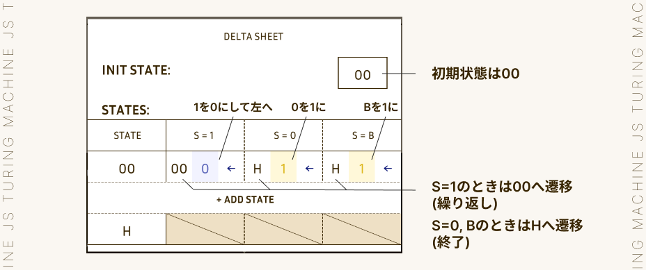

# TuringMachineJS

p5.js を使い、見た目よし！動きよし！なチューリングマシンを作りました。

(デモ動画は1を加算するプログラムを実行する様子です。)

[ここから遊べます](https://chloro096.github.io/TuringMachineJS/)

## チューリングマシンとは？

1936 年に、アラン・チューリングが考えた架空の機械です。

構造はシンプルで、文字が一つ書き込める「マス目」が無限に並んだ 1 次元の記憶テープと、マス目を読み書きするヘッド、読み取った内容に応じて処理を行う制御部の 3 つからなります。

制御部の処理に基づいて、テープを左右に動かしながら文字を読み書きすることで計算を行います。

世の中には様々な計算モデルがあり、それぞれのモデルで計算可能なことと、計算可能でないことがあります。

ではそれら全てを含めて、機械的に計算できることの限界はどこにあるのでしょうか。

現在のところ、それは万能チューリングマシンと同等の計算能力を持つ計算モデルにより計算可能であることだと考えられています(チャーチ・チューリングのテーゼ)。

万能チューリングマシンと同等の計算能力を持つ計算モデルは「チューリング完全」であるといい、計算モデルがもつ計算能力の指標として用いられます。

## 遊びかた

### 各部説明

- 実行スイッチ / 停止ボタン :

  実行スイッチをクリックするとチューリングマシンが動作します。動作中に停止ボタンをクリックすると実行を中断し停止します。

- 状態遷移表 :

  チューリングマシンの「プログラム」を書き込みます。クリックすると編集できます。編集中はシートの外側をクリックすることで元の画面に戻ります。

- 状態表示口 :

  実行中、「現在の状態」を表示する穴です。

- 読み書きヘッド :

  記録テープに読み取り/書き込みを行うヘッドです。

- 記録テープ :

  チューリングマシンのプログラムに与える「入力」を書き込んだり、それに対する「出力」が書き込まれたりするテープです。各マスには1, 0, Bいずれかのシンボルを1つ書き込むことが出来ます。

### TuringMachineJSの動き

チューリングマシンは、状態遷移表に基づいて記憶テープのシンボルを読み書きしながら状態遷移を繰り返す機械です。

状態遷移表を「プログラム」、記憶テープを「入力・出力」に対応させて考えるとわかりやすいと思います。

具体的には以下の4ステップを繰り返します。

1. テープの読み取り

   まず、読み書きヘッドの位置にある記憶テープの「マス」を読み取ります。

   各マスには1, 0, Bのいずれかのシンボルが1つ書かれています。

   ***

   シンボル S := { 1 | 0 | B }
   - B : BlankのB。空白文字。何も書かれていないことを表すのに使える。

   ***

   ※ チューリングマシンは、1, 0, bに限らず任意のシンボルを2以上の任意の個数だけ用いてつくることができますが、TuringMachineJSでは1, 0, bの3つを用いる仕様にしています。

2. 状態遷移表の確認

   テープを読み取ると、次に状態遷移表を確認します。

   状態遷移表は各行がそれぞれ1つの状態を表します。このうち、「現在の状態」は状態表示口に表示されます。一番初めの状態は、状態遷移表の冒頭「INIT STATE」で決めることが出来ます。

   

   各状態には「S=1」, 「S=0」, 「S=B」の3つのセクションあります。

   

   チューリングマシンはこの3つのうち、先ほどテープから読み取ったシンボルに対応するセクションを確認します。

   セクションは、「未定義」である場合と「定義済み」である場合の2通りがあります。

   

   未定義である場合、ここでチューリングマシンは停止し、実行を終了します。

   定義済みであるセクションには3つの情報が記録されています。左からそれぞれ「a.次に遷移する状態」, 「b.テープに書き込むシンボル」, 「c.テープの移動方向」です。

   ***

   状態 Q := { H | 00 | 01 | 02 | ... }
   - 状態は任意の数だけ増やすことが出来る。
   - H : HoltのH。1,0,B全てのセクションが未定義になっており、実行を終了するための状態として使える。

   ***

   移動方向 D := { L | R }
   - 左(L)か右(R)のいずれか。

   ***

3. テープの書き換えと移動

   遷移表から読み取った情報を使って、テープの書き換えと移動を行います。

   まず、読み取った「b.テープに書き込むシンボル」で読み書きヘッドの位置のマスを上書きします。

   その後、読み取った「c.テープの移動方向」へ1マス、テープを移動させます。

4. 状態の遷移

   最後に「a.次に遷移する状態」へ状態遷移を行います。次はこれを「現在の状態」として、1.の手順から再び動作を行います。

   これを停止するまで繰り返すことで計算を行います。

### 操作方法

TuringMachineJSは直感的に操作できるよう設計しています。

- テープ
  - 左右移動 : 左右矢印キー(実行中は不可)
  - シンボルの書き込み : マウスで「マス」をホバーし、1, 0, b キーで入力

- 状態遷移表

  表全体の操作
  - 編集 : 状態遷移表をクリック
  - 編集の終了 : 状態遷移表の外部をクリック
  - 状態を追加 : 「+ ADD STATE」ボタンをクリック
  - 状態を削除 : 状態番号をホバーすると表示される「DELETE」ボタンをクリック (末尾の状態のみ削除可)
  - 表の上下スクロール : マウスホイール

  セクションの操作
  - 未定義セクションに変更 : 定義済みセクションをホバーしてdeleteキー
  - 定義済みセクションに変更 : 未定義セクションをクリック

  セクション内の情報
  - 初期状態 / 次の状態 : ホバーすると表示される -, + ボタンをクリックして変更 or ホバーして数字キー / hキーで入力(存在する状態のみ入力可能)
  - 書き込むシンボル : クリックして変更 or ホバーして1, 0, b キーで入力
  - 移動方向 : クリックして変更 or ホバーして左右矢印キーで入力

- その他
  - 実行 : EXECUTEと書かれた実行スイッチをクリック
  - 停止 : 実行中にSTOPと書かれた停止ボタンをクリック
  - 状態遷移表のセーブ : sキーで状態遷移表をjson形式で保存
  - 状態遷移表のロード : 画面外「ファイルを選択」ボタンでjsonファイルを読み込み

### 1を足すチューリングマシンを作ってみる

実際に状態遷移表を作ってみましょう。

試しに、2進数で表された数字をテープに入力し実行すると、その数字に1を足した値がテープに残るようなものを作ってみましょう。どうすれば作れるでしょうか。

例えば「10」に1を足すには、1の位の0を1に変えれば「11」となり、完成です。1の位が0の場合は、全てこれで対応できそうです。

では1の位が1の場合はどうでしょうか。最もシンプルな「1」に1を足す場合を考えてみます。これは、1の位の1を0に変え、「B」となっている2の位の位置を1に変えることで、「10」とすることが出来ます。

「101」や「11」の場合はどうでしょう。同様に1の位を1に変えた後(「101」→「100」, 「11」→「10」)、2の位に繰り上がりの1を足します。2の位が0なら1に変えることで(「100」→ 「110」)、2の位が1なら0に変えて4の位に1を足すことで(「B10」→「B00」→「100」)、これは実現できます。このように、各位で再帰的に「1を足す」という操作を繰り返すことで、1を足した値全体を求めることが出来そうです。

まとめると、

- シンボルが「0」 : 1に変えて終了
- シンボルが「1」 : 0に変えて、左の位に移って繰り返す
- シンボルが「B」 : 1に変えて終了

という状態遷移を作れば実現できそうです。

これを、以下のように状態遷移表をつくることで表現できます。

これを実際に動かしてみたものが冒頭のデモ動画です！

「11」に1を加えた「100」が出力できています。

### sheets/ について

これ以外にも様々な状態遷移表が作れます。

冒頭で説明したことからわかる通り、状態遷移表さえ作れればあらゆる計算をチューリングマシンで実行できます。

サンプルとして、状態遷移表を保存したjsonファイルをいくつかsheets/ディレクトリに配置しました。ダウンロードし、画面外「ファイルを選択」ボタンから読み込むと実行できます。

- AddOne.json :

  1を足します。テープに2進数値を入力し、その1マス左に読み書きヘッドを合わせて実行すると、1を足した値を計算し出力値の1マス左に読み書きヘッドがある状態で終了します。そのまま実行すればさらに1を足せます。

- SubOne.json :

  1を引きます。AddOneと同じように使えます。

- Add2Num.json :

  2つの2進数値の足し算を行います。1つ目の2進数値と2つ目の2進数値の間に「B」を1マスはさみ、1つ目の2進数値の1マス左に読み書きヘッドを合わせて実行すると、和を計算し出力値の1マス左に読み書きヘッドがある状態で終了します。

  桁数を記録しながら計算する必要があるので、1桁あたり計算値と制御フラグの2マスを使って、左側にメモを取りながら計算を行います。最後にメモを消して結果を出力してくれます。

- Mul2Num.json :

  2つの2進数値の掛け算を行います。Add2Numと同じように使います。

  掛けられる側・掛ける側それぞれについてどこまで計算したか桁数を記録しながら計算するため、1桁あたり計算値と制御フラグ2つの3マスを使って、左側にメモをとりながら計算を行います。

  状態数は45と作った中で最も多く、計算にもとても時間がかかります。一生懸命計算してくれている様子を眺めるだけでとても楽しいです。

- Init.json :

  まっさらな状態遷移表です。作っている途中でリセットしたくなったときに便利です。ただし、リセットすると保存していないそれまでの状態遷移表は消えてしまうので注意してください。

他にも様々な状態遷移表が作れるはずです！ぜひ遊んでみてください。

[Let's Play !](https://chloro096.github.io/TuringMachineJS/)
